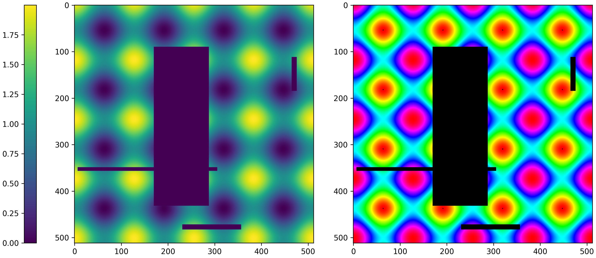

# hue-encoding
This project provides efficient vectorized Python code to perform depth `<->` color encoding based on

> Sonoda, Tetsuri, and Anders Grunnet-Jepsen.
"Depth image compression by colorization for Intel RealSense depth cameras." Intel, Rev 1.0 (2021).

Here's the encoding of depth values from a moving sine wave.

https://github.com/user-attachments/assets/2814d21a-3d1b-4857-b415-dc1c5ae31460


## Properties

The encoding is designed to transform 16bit single channel images to RGB color images that can be processed by standard (lossy) image codec with minimal compression artefacts. This leads to a compression factor of up to 80x.

## Method

The compression first transforms raw depth values to the applicable encoding range [0..1530] (~10.5bit) via a normalization strategy (linear/disparity) using a user provided near/far value. Next, for each encoding value the corresponding color is computed. The color is chosen carefully to respect the aforementioned properties. Upon decoding the reverse process is computed.

### Depth transformations
The encoding allows for linear and disparity depth normalization. In linear mode, equal depth ratios are preserved in the encoding range [0..1530], whereas in disparity mode more emphasis is put on closer depth values than on larger ones, leading to more accurare depth resolution closeup.


## Implementation

This implementation is vectorized using numpy and can handle any image shapes `(*,H,W) <-> (*,H,W,3)`. For improved performance, we precompute encoder and decoder lookup tables to reduce encoding/decoding to a simple lookup. The lookup tables require ~32MB of memory. Use `use_lut=False` switch to rely on the pure vectorized implementation. See benchmarks below for effects.

## Usage

There is currently no PyPi package to install, however the code is contained in a single file for easy of distribution :)

```python
# Import
import huecodec as hc

# Random float depths
d = rng.random((5,240,320), dtype=np.float32)*0.9 + 0.1

# Encode
rgb = hc.depth2rgb(d, zrange=(0.1,1.0), inv_depth=False)
# (5,240,320,3), uint8

# Decode
depth = hc.rgb2depth(rgb, zrange=(0.1,1.0), inv_depth=False)
# (5,240,320), float32
```

## Evaluation

### Encoding/Decoding Roundtrips

The script `python analysis.py` compares encoding and decoding characteristics for different standard video codecs using hue depth encoding. The reported figures have the following meaning:

 - **rmse** [m] root mean square error per depth pixel between groundtruth and transcoded depthmaps
 - **tenc** [milli-sec/frame] encoding time per frame
 - **tdec** [milli-sec/frame] decoding time per frame
 - **nbytes** [kb/frame] kilo-bytes per encoded frame on disk.

All tests are carried out on a 12th Gen Intel® Core™ i9-12900K × 24 with NVIDIA GeForce RTX™ 3090 Ti.

```shell
# run analysis only for specific variants
python analysis.py variant=[hue-only,h264-lossless-gpu]
```

#### Synthetic Depthmaps

Each test encodes/decodes a sequence `(100,512,512)` of np.float32 depthmaps in range `[0..2]` containing a sinusoidal pattern plus random hard depth edges. The pattern moves horizontally over time.



The reported values are

| variant           | zrange [m]   |   rmse [m] |   tenc [ms/img] |   tdec [ms/img] |   size [kb/img] |
|:------------------|:-------------|-----------:|----------------:|----------------:|----------------:|
| hue-only          | (0.0, 2.0)   |    0.00033 |            1.92 |            1.35 |          768.00 |
| hue-only          | (0.0, 4.0)   |    0.00067 |            1.95 |            1.38 |          768.00 |
| h264-lossless-cpu | (0.0, 2.0)   |    0.00033 |            6.46 |            3.08 |           31.97 |
| h264-lossless-cpu | (0.0, 4.0)   |    0.00067 |            5.29 |            2.93 |           26.30 |
| h264-default-cpu  | (0.0, 2.0)   |    0.09704 |            5.56 |            2.01 |           11.81 |
| h264-default-cpu  | (0.0, 4.0)   |    0.12807 |            5.27 |            1.89 |            9.51 |
| h264-lossless-gpu | (0.0, 2.0)   |    0.00033 |            2.83 |            2.25 |           70.97 |
| h264-lossless-gpu | (0.0, 4.0)   |    0.00067 |            2.60 |            2.06 |           30.75 |
| h264-default-gpu  | (0.0, 2.0)   |    0.09996 |            2.56 |            2.73 |           18.38 |
| h264-default-gpu  | (0.0, 4.0)   |    0.12741 |            2.84 |            2.43 |           13.42 |

### Hue Runtime Benchmark

Here are benchmark results for encoding/decoding float32 depthmaps of various sizes with differnt characteristics. Note, this is pure depth -> color -> depth transcoding without any video codecs involved.

```
------------- benchmark: 8 tests ------------
Name (time in ms)              Mean          
---------------------------------------------
enc_perf[LUT-(640x480)]        2.1851 (1.0)    
dec_perf[LUT-(640x480)]        2.2124 (1.01)   
enc_perf[LUT-(1920x1080)]     17.9139 (8.20) 
dec_perf[LUT-(1920x1080)]     16.4741 (7.54)   
enc_perf[noLUT-(640x480)]     22.3938 (10.25)  
dec_perf[noLUT-(640x480)]      6.9320 (3.17)   
dec_perf[noLUT-(1920x1080)]   74.6038 (34.14)  
enc_perf[noLUT-(1920x1080)]  158.0871 (72.35)  
---------------------------------------------
```

```shell
# run tests and benchmarks
pytest
```

### Note on Video Codecs

When tuning the prameters for a video codec you need to take into account lossy compression that happens on  different levels of encoding:
 - **spatial/temporal** quantization based how images change over time. Usually controlled by the codec `preset/profile` (lossless, low-latency,...) and quality parameters such as `crf`, `qp`.
 - **color space** quantization due to converting RGB to target pixel format. Different codecs support different pixel color formats of which most perform a lossy compression from rgb to target space. 

Print encoder supported options and pixel formats
```shell
# print encoder options
ffmpeg -h encoder=h264_nvenc
```

See packing and compression of color formats
https://github.com/FFmpeg/FFmpeg/blob/master/libavutil/pixfmt.h


### Takeaways
Here are some takeaways
 - adjust zrange as tightly as possible to your use-case
 - prefer loss-less codecs if affordable

## Notes

The original paper referenced is potentially inaccurate in its equations. This has been noted in varios posts [#10415](https://github.com/IntelRealSense/librealsense/issues/10145),[#11187](https://github.com/IntelRealSense/librealsense/issues/11187),[#10302](https://github.com/IntelRealSense/librealsense/issues/10302).

This implementation is based on the original paper and code from
https://github.com/jdtremaine/hue-codec/.